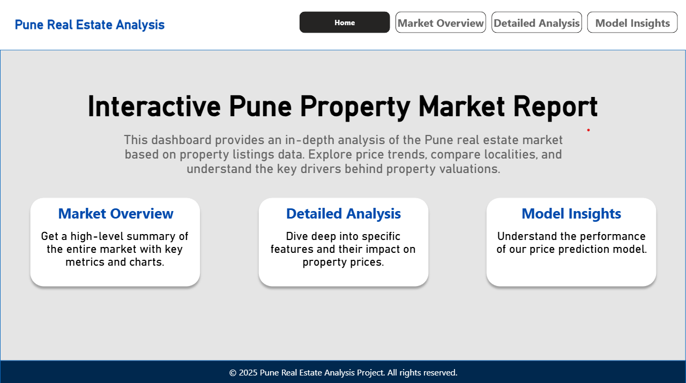
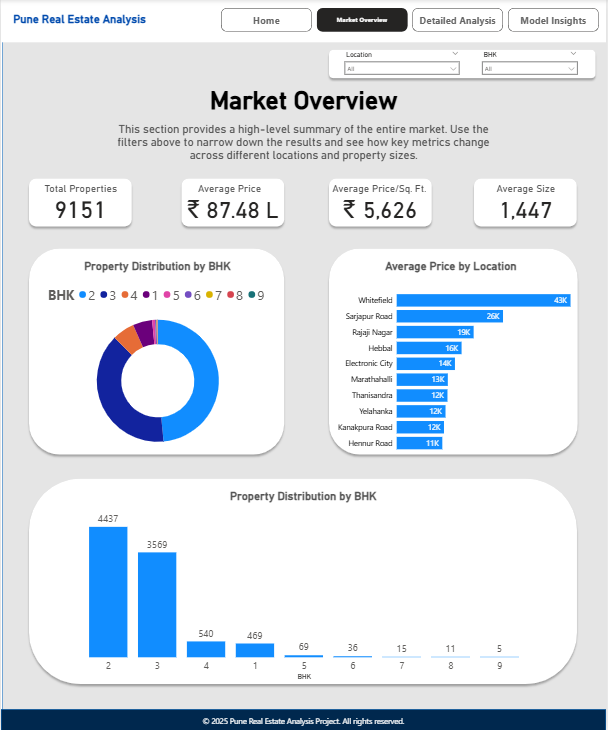

# 🏠 Pune Real Estate Price Predictor & Analysis Tool

This project is an end-to-end data science solution designed to analyze the Pune real estate market. It leverages data cleaning, feature engineering, and machine learning to provide two primary outputs: an interactive analytical dashboard and a live price prediction web application. This repository contains all the necessary code, data, and models to replicate the project.

---

## 🚀 Key Features

- **Interactive Dashboard**: A comprehensive 4-page Power BI dashboard for exploring historical market trends, price distributions, and detailed property feature analysis.
- **Live Prediction App**: A user-friendly web application built with Streamlit that uses a trained XGBoost model to predict property prices in real-time based on user inputs.
- **Data-Driven Analysis**: Based on a real-world housing dataset and in-depth analysis performed in Jupyter Notebook.
- **End-to-End Workflow**: Demonstrates a full data science lifecycle, from ingestion to deployment.

---

## 🔗 Live Demos & Screenshots

- **Live Streamlit App**: [Click here to try the app](https://your-streamlit-link.com)
- **Published Power BI Dashboard**: [Click here to explore the dashboard](https://your-powerbi-link.com)

| Web App                           | Market Overview Dashboard         |
|----------------------------------|-----------------------------------|
|  |  |

---

## 🛠️ Tech Stack

| Area                | Tools & Libraries                                          |
|---------------------|------------------------------------------------------------|
| **Programming**     | Python 3.10+                                               |
| **Data Analysis**   | Pandas, NumPy, Jupyter                                     |
| **Modeling**        | Scikit-learn, XGBoost                                      |
| **Visualization**   | Power BI, Matplotlib, Seaborn                              |
| **Web App**         | Streamlit                                                  |

---

## 📂 Project Structure

```bash
PuneRealEstate/
├── app/
│   └── predictor_app.py                # The Streamlit web application
├── data/
│   ├── pune_house_data.csv            # Original raw dataset
│   ├── dashboard_data.csv             # Cleaned data for Power BI
│   └── feature_importance.csv         # Feature importance values
├── models/
│   ├── pune_house_price_model.pkl     # Trained XGBoost model
│   └── model_columns.json             # List of feature columns
├── notebooks/
│   └── pune_real_estate_analysis.ipynb # All EDA and modeling work
├── Power BI/
│   └── Pune_Real_Estate_Dashboard.pbix # Power BI dashboard file
├── screenshots/
│   ├── 1.png                          # Screenshot of Home Page
│   └── 2.png                          # Screenshot of Dashboard
└── requirements.txt                   # Python dependency list
```

---

## ⚙️ Setup and Installation

```bash
# 1. Clone the repository
git clone https://github.com/your-username/Pune-Real-Estate-Predictor.git
cd Pune-Real-Estate-Predictor

# 2. Create and activate a virtual environment
python -m venv venv
source venv/bin/activate        # Windows: venv\Scripts\activate

# 3. Install required libraries
pip install -r requirements.txt

# 4. Run the Streamlit App
cd app
streamlit run predictor_app.py
```

---

## 🔬 Methodology

- **Data Cleaning**: Handled missing values and standardized inconsistent fields (like total_sqft ranges).
- **Feature Engineering**: Created `bhk` and `price_per_sqft` for better predictive modeling.
- **Outlier Removal**: Used location-wise standard deviation to eliminate anomalies.
- **Model Training**: Trained an XGBoost Regressor with an R² score of 0.73.
- **Deployment Ready**: Saved artifacts for production (joblib + JSON).

---

## 👨‍💻 About Me

Hi! I'm **Harsh Bandal**, a passionate data science student with a deep interest in ML, BI tools, and building impactful data solutions.

- 💼 Proficient in Python, SQL, Scikit-learn, and Streamlit.
- 🔎 Focused on converting messy data into valuable insights.
- 📊 Obsessed with dashboards and meaningful visualizations.

📫 **Connect with me**:  
[LinkedIn](https://www.linkedin.com/in/harsh-bandal-3240912b7/) | [GitHub](https://github.com/harry16102003) | harshbandal.scoe.comp@gmail.com

---

## 📜 License

This project is licensed under the MIT License - see the LICENSE file for details.
